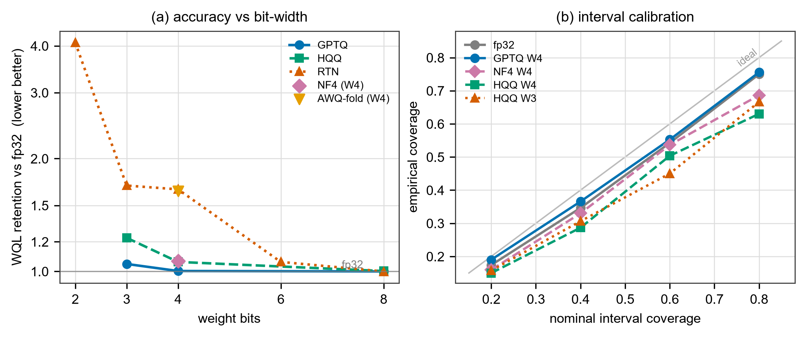

# How Low Can Chronos-2 Go? Post-Training Quantization of a Time-Series Foundation Model

*Anonymous submission — under review.*

## Abstract

Time-series foundation models (TSFMs) such as Chronos-2 deliver strong zero-shot
probabilistic forecasts, but their deployment cost is rarely studied and, unlike large
language models, *nothing* is known about how they respond to post-training
quantization (PTQ). We present the first systematic PTQ study of a TSFM: eighteen
weight-quantization configurations spanning six method families (round-to-nearest,
torchao, bitsandbytes INT8/NF4, HQQ, GPTQ, and activation-aware scale folding) and
two-to-eight bits, evaluated zero-shot on the 27-dataset Chronos benchmark. Beyond
point (MASE) and probabilistic (weighted quantile loss, WQL) accuracy, we introduce two
calibration-aware diagnostics — mean absolute coverage error and a quantile-crossing
rate — because a probabilistic forecaster can degrade in ways aggregate accuracy cannot
see. Four findings emerge. (i) 8-bit quantization is free for every method (≤1.3% WQL
change) and shrinks the model 4×. (ii) Hessian-aware GPTQ retains full-precision
accuracy down to **3 bits** (WQL retention 1.05, 95% CI [0.99, 1.14]), where the naive
baseline degrades 70%. (iii) The *method* matters far more than the *bit-width*: at 4
bits, retention spans 0.996–1.66 across methods. (iv) Interval calibration and quantile
monotonicity degrade *before* accuracy does — 8-bit quantization leaves WQL untouched
yet quadruples the quantile-crossing rate — so accuracy-only evaluation overstates the
quality of a quantized forecaster. We release the framework, which reproduces published
per-task benchmark numbers to <10⁻⁶, and all per-series predictions.

## 1. Introduction

Time-series foundation models (TSFMs) — Chronos [Ansari et al., 2024], Chronos-2 [Ansari
et al., 2025], TimesFM, Moirai — forecast unseen series zero-shot and are increasingly
deployed on CPU-only servers, edge devices, and high-throughput batch pipelines where
full-precision inference is costly. Quantization is the standard efficiency lever for
large language models (LLMs), but its lessons do not obviously transfer to TSFMs, which
are small (Chronos-2 has 120M parameters, a regime where quantization bites harder
[Li et al., 2024]), encoder-only and non-autoregressive (no KV cache, so LLM
decode-centric methods do not apply), and — critically — emit *probabilistic* forecasts
whose calibration and quantile monotonicity matter, not just point accuracy.

Despite an extensive LLM-quantization literature, **no published work quantizes the
weights of any Chronos-family or comparable TSFM** (in this literature "quantization"
usually denotes Chronos-1's input value-*binning*, a distinct notion). We close that gap
with a controlled study across method families and bit-widths, and argue that evaluating
a *quantized probabilistic* forecaster demands metrics beyond those on TSFM
leaderboards.

**Contributions.** (1) The first systematic PTQ study of a TSFM: 18 configurations × 6
method families × 5 bit-widths, zero-shot on 27 datasets, with bootstrap confidence
intervals on every aggregate. (2) A calibration-aware evaluation protocol for compressed
probabilistic forecasters, adding interval-coverage error and a quantile-crossing rate,
which reveal failure modes invisible to WQL/MASE. (3) Concrete findings and a deployment
recommendation: GPTQ reaches full-precision accuracy *and* calibration at 3–4 bits,
whereas simpler methods trade calibration first. (4) An open, reproducible framework that
reproduces published benchmark numbers to floating-point precision and releases all
per-series predictions, so any further metric is computable without re-running models.

## 2. Setup

**Model.** Chronos-2 [Ansari et al., 2025] (`amazon/chronos-2`) is a 119.5M-parameter,
T5-derived *encoder-only* transformer (12 layers, $d_\text{model}{=}768$, RoPE,
alternating "time" and "group" attention). It ingests patches of a per-instance-
normalized series through a residual embedding (no input tokenization) and emits, in one
non-autoregressive forward pass, direct multi-step forecasts at 21 quantile levels. It
ships in fp32 (478 MB). All quantization is applied to the model's `nn.Linear` weights;
LayerNorm, the input embedding, and the quantile head follow standard practice and stay
in fp32, and bf16 (not fp16, which overflows in T5-lineage models) is the deployment
baseline. We verify that computational-invariance rotations and activation-aware folding
apply exactly to this architecture (Section 4).

**Methods.** We evaluate weight-only PTQ across six families runnable on commodity
hardware: **RTN** (symmetric round-to-nearest, per-channel/per-tensor, plus a simulated
sub-8-bit sweep for the accuracy–bit curve); **torchao** INT8 weight-only and INT8
dynamic-activation (W8A8); **bitsandbytes** LLM.int8() [Dettmers et al., 2022] and NF4
[Dettmers et al., 2023]; **HQQ** [Badri & Shao, 2023], a calibration-free half-quadratic
solver, at 8/4/3 bits; **GPTQ** [Frantar et al., 2023], a Hessian-aware error-compensating
quantizer we implement directly on the encoder's linear layers with one-shot
calibration; and **AWQ-style** activation-aware scale folding [Lin et al., 2024]. Groups
of methods are exercised at W8, W4 (group sizes 64/128), W3, and W2.

**Protocol & metrics.** We evaluate zero-shot on the 27-dataset Chronos benchmark
[Ansari et al., 2024] (190,674 forecasts) using the `fev` library — the harness the
Chronos-2 authors use — so our numbers are directly comparable with the public
leaderboard. Point accuracy is MASE and probabilistic accuracy is weighted quantile loss
(WQL, 9 quantile levels); per task each is normalized by a seasonal-naive baseline and
aggregated by geometric mean into a *skill score*, with pairwise *win rates*. Our
full-precision Chronos-2 attains 0.425 WQL skill and an 88% win rate over seasonal-naive,
reproducing the paper's ordering; as a reproduction gate, our seasonal-naive matches the
published per-task MASE/WQL to <10⁻⁶.

For quantized models the key quantity is **retention**: the geometric-mean ratio
$\text{WQL}(\text{quant})/\text{WQL}(\text{fp32})$ over the 27 tasks (1.00 = parity;
1.05 = 5% worse), with a 1000-resample bootstrap 95% CI. Because a probabilistic
forecaster can lose quality without moving WQL, we add two diagnostics. **MACE** (mean
absolute coverage error) averages $|\text{empirical}-\text{nominal}|$ over the central
80/60/40/20% prediction intervals. **QCR** (quantile-crossing rate) is the fraction of
forecast points whose predicted quantiles are non-monotone — a structural defect a direct
quantile head can acquire under quantization. Both are computed by the same harness; all
per-series predictions are persisted so any further metric needs no model re-run.

## 3. Results

Table 1 summarizes representative configurations; Figure 1 plots the full accuracy–bit
curve and calibration. The complete 18-variant matrix is released.

**Table 1.** Representative variants, full 27-task benchmark. Retention = geometric-mean
WQL(quant)/WQL(fp32), [95% bootstrap CI]. *cov80* = empirical coverage of the nominal-80%
interval (fp32: 0.750). *QCR* = quantile-crossing rate (fp32: 0.039). BPW = effective
bits/weight incl. scales; †GPTQ/AWQ/sim store dequantized grids in fp32 (accuracy arms) —
BPW is the *achievable* footprint. Size is on-disk MB for storage-real methods.

| Variant | Bits | BPW | Size MB | WQL ret. [CI] | MASE ret. | cov80 | QCR |
|---|---|---|---|---|---|---|---|
| fp32 (reference) | 32 | 32.0 | 478 | 1.000 | 1.000 | 0.750 | 0.039 |
| RTN W8 | 8 | 8.03 | 120 | 0.999 [0.997, 1.001] | 1.001 | 0.749 | 0.149 |
| GPTQ W8 | 8 | 8.13† | — | 1.000 [0.990, 1.009] | 1.003 | 0.749 | 0.064 |
| HQQ W8 | 8 | 9.00 | 120 | 1.002 [1.000, 1.004] | 1.000 | 0.746 | 0.086 |
| **GPTQ W4** | 4 | 4.13† | — | **1.002 [0.985, 1.023]** | 1.011 | 0.756 | 0.254 |
| HQQ W4 | 4 | 5.00 | 60 | 1.060 [1.017, 1.124] | 1.027 | 0.630 | 0.420 |
| NF4 W4 | 4 | 4.13 | 60 | 1.065 [1.001, 1.149] | 1.026 | 0.686 | 0.396 |
| AWQ-fold W4 | 4 | 4.03† | — | 1.639 [1.377, 2.011] | 1.409 | 0.481 | 0.599 |
| **GPTQ W3** | 3 | 3.25† | — | **1.047 [0.988, 1.137]** | 1.059 | 0.791 | 0.366 |
| HQQ W3 | 3 | 4.20 | 48 | 1.229 [1.091, 1.481] | 1.143 | 0.666 | 0.589 |
| RTN W2 (sim) | 2 | 2.0† | — | 4.082 [3.083, 5.566] | 3.108 | 0.060 | 0.523 |

**F1 — 8-bit is free, for every method.** All six W8 configurations retain WQL within
[0.999, 1.013] and MASE within [1.000, 1.011] of fp32 (Table 1; Fig. 1a), at 4×
compression. Even W8A8 with dynamic-activation quantization costs only 1.3%. Eight-bit
quantization of Chronos-2 is, for practical purposes, lossless regardless of method.

**F2 — GPTQ reaches full-precision accuracy at 3 bits.** GPTQ retains parity at 4 bits
(retention 1.00, both group sizes; CIs include 1.0) and, remarkably, at **3 bits**
(1.047, CI [0.988, 1.137] — statistically indistinguishable from fp32), where HQQ loses
23% and naive RTN 70% (Fig. 1a). Hessian-aware error compensation moves the accuracy
cliff at least one bit lower than any calibration-free method. (A dev-subset signal that
GPTQ *beat* fp32 did not survive the full 27-task evaluation, resolving to parity — we
report the confirmed result.)

**F3 — method dominates bit-width.** At a fixed 4 bits, WQL retention spans 0.996 (GPTQ)
to 1.66 (RTN) — a 66-point gap — whereas moving a *good* method from 8 to 4 bits costs
≤6% (Fig. 1a). For a TSFM, *how* you quantize matters far more than *how much*. This
inverts the intuition that bit-width is the primary knob.

**F4 — calibration and monotonicity degrade before accuracy, and only GPTQ preserves
them.** This is the study's central cautionary finding. At 8 bits, accuracy is perfectly
retained yet the quantile-crossing rate already quadruples (0.039→0.149 for RTN;
Table 1) — a structural defect in the quantile head that WQL and MASE cannot see. At 4
bits, GPTQ keeps interval coverage intact (cov80 0.756 vs fp32 0.750; Fig. 1b) while HQQ
and NF4 sag to 0.630 and 0.686 — a user trusting the "80%" band of HQQ-W4 actually holds
a 63% band. GPTQ is the *only* 4-bit method that preserves both accuracy and calibration;
no method fully preserves quantile monotonicity. Evaluating a quantized probabilistic
forecaster on accuracy alone therefore overstates its deployable quality [cf. Dettmers
et al. on distributional fidelity, 2024].

**F5 — damage is tail-concentrated.** Mean retention hides worst cases. HQQ-W3 averages
1.23 but its worst task is 8.2× and 44% of tasks exceed 1.10; GPTQ-W4-g64 has a median
per-task ratio of 0.998, a 90th percentile of 1.037, and only 4% of tasks above 1.10.
Per-series distributions — released for every run — are the honest picture, echoing the
"hard inputs degrade first" pattern from encoder-model quantization.

**F6 — activation-aware folding is a rigorous negative result.** For Chronos-2 the AWQ
scale fold is *exact* (pre-norm RMSNorm weights absorb the scale; the ReLU MLP is
positively homogeneous; $v\!\to\!o$ folds cleanly), which we verify numerically. Yet at
4 bits AWQ-fold + RTN (1.64) barely differs from plain RTN (1.66) and is far behind GPTQ
(Fig. 1a, overlapping points at 4 bits). On this model, error *compensation* (GPTQ) is
the effective mechanism; activation *scaling* alone is not.

**Efficiency.** Storage-real 4-bit models occupy ≈60 MB (8× smaller) and cut peak
batch-1 GPU memory from 493 MB (fp32) to 87 MB for NF4 (5.7×). Throughput, however, is
flat (~120 series/s at batch 256, vs 110 for fp32): our reference dequantize-then-GEMM
paths buy footprint, not speed — the expected outcome for unfused weight-only kernels,
and the reason optimized-kernel (torchao, ONNX) or activation-quantized paths are needed
for latency gains. Memory-bound and edge deployments benefit immediately; compute-bound
throughput does not.

**Figure 1.** *(a)* WQL retention vs weight bits by method (log scale; lower is better,
1.0 = fp32). GPTQ tracks fp32 to 3 bits; the method spread at 4 bits exceeds the 8→4-bit
gap of any single method; AWQ-fold sits on the RTN line. *(b)* Empirical vs nominal
interval coverage: GPTQ-W4 tracks fp32 while HQQ/NF4 systematically under-cover.

## 4. Discussion, Limitations, and Conclusion

**Recommendation.** For deploying Chronos-2: use 8-bit for a free 4× reduction with any
toolkit; for 4 bits and below, use GPTQ (or another Hessian-aware method) rather than a
calibration-free quantizer — not merely for accuracy but because it is the only method
that preserves interval calibration, the property forecasting users depend on. Report
calibration and quantile-crossing alongside WQL whenever a probabilistic model is
compressed.

**Limitations.** We study one 120M model on univariate zero-shot tasks; covariate/
multivariate tasks, larger and smaller TSFMs, and quantization-aware training are future
work. Our GPTQ/AWQ arms are accuracy-exact simulations (dequantized grids in fp32
containers); realized latency for those methods requires packed kernels we do not
implement (their achievable footprint is reported). Latency is hardware-specific (one
laptop GPU); retention ratios are the transferable claim. We assess but exclude
KV-cache/vector methods such as TurboQuant [Zandieh et al., 2025], which do not apply to
a cache-free encoder.

**Conclusion.** Chronos-2 quantizes remarkably well: 8-bit is free, and Hessian-aware
4- and 3-bit quantization retains full-precision forecasting accuracy. But probabilistic
structure — interval calibration and quantile monotonicity — degrades before accuracy,
and only error-compensating methods preserve it. Compressing a probabilistic forecaster
is therefore not merely an accuracy-retention problem, and should not be evaluated as
one.

## Reproducibility

Code, configs, environment lockfile, vendored benchmark definitions, per-task summaries,
and all per-series predictions are released. The harness reproduces published per-task
seasonal-naive MASE/WQL to <10⁻⁶ (continuously tested). All results in this paper are
regenerated by `python -m chronosquant.analysis.campaign`.

## References

Ansari et al. Chronos: Learning the Language of Time Series. TMLR 2024. arXiv:2403.07815.
· Ansari et al. Chronos-2: From Univariate to Universal Forecasting. 2025.
arXiv:2510.15821. · Badri & Shao. Half-Quadratic Quantization (HQQ). 2023. · Dettmers et
al. LLM.int8(). NeurIPS 2022. arXiv:2208.07339. · Dettmers et al. QLoRA (NF4). NeurIPS
2023. arXiv:2305.14314. · Dettmers et al. Accuracy is Not All You Need. NeurIPS 2024.
arXiv:2407.09141. · Frantar et al. GPTQ. ICLR 2023. arXiv:2210.17323. · Aksu et al.
GIFT-Eval. 2024. arXiv:2410.10393. · Lin et al. AWQ. MLSys 2024. arXiv:2306.00978. · Li
et al. Evaluating Quantized LLMs. 2024. arXiv:2402.16775. · Xiao et al. SmoothQuant. ICML
2023. arXiv:2211.10438. · Shchur et al. fev-bench. 2025. arXiv:2509.26468. · Zandieh et
al. TurboQuant. 2025. arXiv:2504.19874.
